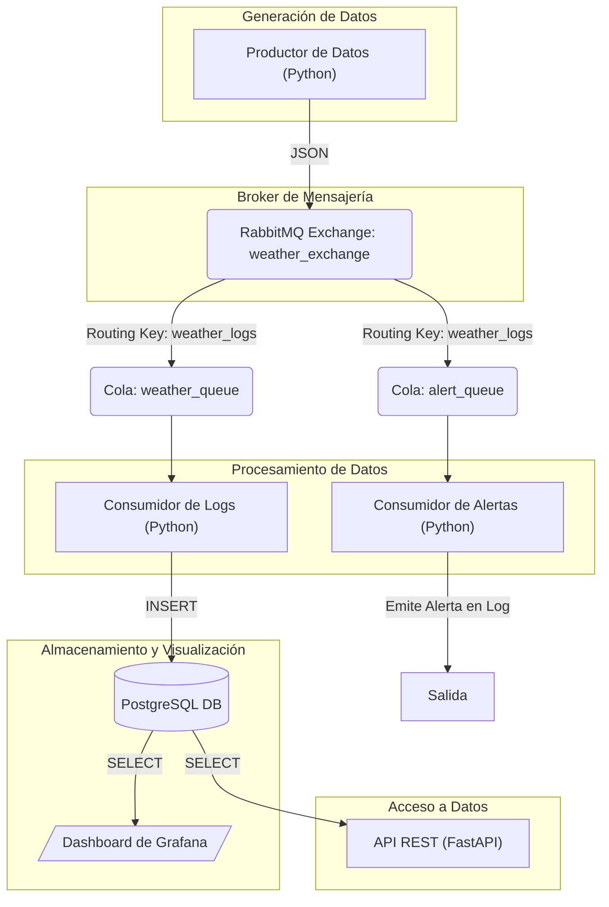

# Sistema de Gestión de Logs para Estaciones Meteorológicas


Este proyecto implementa un sistema robusto y escalable para la ingesta, procesamiento, almacenamiento y visualización de datos de estaciones meteorológicas en tiempo real. La arquitectura se basa en microservicios desacoplados que se comunican a través de un broker de mensajería, garantizando alta disponibilidad, resiliencia y escalabilidad.

---

### Esquema de la Arquitectura

Este diagrama ilustra el flujo de datos a través de los diferentes componentes del sistema, desde la generación hasta la visualización.

<details>
<summary>Ver código Mermaid para el diagrama</summary>


---

### Características Principales

-   **Procesamiento Asíncrono:** Uso de RabbitMQ para desacoplar la generación de datos del procesamiento, garantizando que no se pierdan datos incluso con picos de carga.
-   **Persistencia Robusta:** Almacenamiento de datos en una base de datos PostgreSQL, con persistencia de datos asegurada mediante volúmenes de Docker.
-   **Servicio de Alertas en Tiempo Real:** Un microservicio independiente monitorea el flujo de datos y emite alertas en la consola si se superan umbrales predefinidos.
-   **API REST para Consultas:** Un endpoint de API basado en FastAPI que expone los datos históricos y cuenta con documentación interactiva autogenerada (Swagger UI).
-   **Visualización Interactiva:** Un dashboard en Grafana conectado directamente a la base de datos para la visualización y el análisis de métricas en tiempo real.
-   **Contenerización Completa:** Todo el sistema y sus dependencias están encapsulados en contenedores Docker y orquestados con un único archivo `docker-compose.yml`.
-   **Gestión Simplificada:** Scripts de Shell (`.sh`) para iniciar, detener, limpiar y escalar el entorno con comandos simples y directos.
-   **Escalabilidad Horizontal:** El diseño permite escalar el número de consumidores de datos para manejar cargas de trabajo elevadas con un solo comando, sin necesidad de modificar el código.

---

### Stack Tecnológico

-   **Lenguaje:** Python 3.12
-   **Broker de Mensajería:** RabbitMQ
-   **Base de Datos:** PostgreSQL
-   **API:** FastAPI
-   **Visualización:** Grafana
-   **Orquestación:** Docker & Docker Compose
-   **Automatización:** Scripts de Bash

---

### Estructura del Proyecto

```
.
├── .devcontainer/        # Configuración del entorno de desarrollo de VS Code
├── scripts/              # Scripts de gestión (start, stop, logs, etc.)
├── alert_consumer/       # Microservicio de alertas
├── api_service/          # Microservicio de la API REST
├── consumer/             # Microservicio que guarda en la DB
├── producer/             # Simulador que genera los datos
├── init.sql              # Script de inicialización de la DB
├── requirements.txt      # Dependencias globales de Python
├── README.md             # Este archivo
└── ...
```

---

### Cómo Ejecutar el Proyecto

#### Prerrequisitos

-   Tener instalado [Docker](https://www.docker.com/products/docker-desktop/) en tu sistema.
-   **(Para usuarios de Windows)** Es necesario usar una terminal compatible con Bash como **[Git Bash](https://git-scm.com/downloads)** o **WSL**.

#### Pasos para la Ejecución

1.  **Clonar el Repositorio**
    ```bash
    git clone https://github.com/JoelGonzalez08/sistema-gestion-meteorologica.git
    cd sistema-gestion-meteorologica
    ```

2.  **Hacer los Scripts Ejecutables (solo la primera vez)**
    Este comando otorga los permisos necesarios para ejecutar los scripts de gestión.
    ```bash
    chmod +x scripts/*.sh
    ```

3.  **Iniciar todos los Servicios**
    Este comando construirá las imágenes y levantará todos los contenedores en segundo plano.
    ```bash
    ./scripts/start.sh
    ```
    El sistema estará completamente operativo en unos segundos.

---

### Acceso a los Servicios

Una vez que el sistema está corriendo, todos los servicios son accesibles desde tu navegador:

-   **Dashboard de RabbitMQ:**
    -   **URL:** `http://localhost:15672`
    -   **Usuario:** `guest`
    -   **Contraseña:** `guest`

-   **API REST (con documentación interactiva):**
    -   **URL:** `http://localhost:8000/docs`

-   **Dashboard de Grafana:**
    -   **URL:** `http://localhost:3000`
    -   **Usuario:** `admin`
    -   **Contraseña:** `admin` (te pedirá cambiarla en el primer inicio de sesión).

-   **Base de Datos (para clientes externos como DBeaver):**
    -   **Host:** `localhost`
    -   **Puerto:** `5432`
    -   **Base de datos:** `weatherdb`
    -   **Usuario:** `user`
    -   **Contraseña:** `password`

---

### Guía de Scripts de Gestión

Todos los scripts se ejecutan desde la raíz del proyecto.

| Script          | Comando de Ejemplo                  | Descripción                                                                                                |
| --------------- | ----------------------------------- | ---------------------------------------------------------------------------------------------------------- |
| **start.sh**    | `./scripts/start.sh`                | Inicia todos los servicios en segundo plano. Construye las imágenes si es necesario.                       |
| **stop.sh**     | `./scripts/stop.sh`                 | Detiene todos los contenedores de forma segura, pero conserva los datos.                                   |
| **logs.sh**     | `./scripts/logs.sh`                 | Muestra los logs de todos los servicios en tiempo real.                                                    |
|                 | `./scripts/logs.sh consumer`        | Muestra los logs de un servicio específico (ej. `consumer`, `producer`, `api_service`, etc.).              |
| **clean.sh**    | `./scripts/clean.sh`                | **¡CUIDADO!** Detiene los contenedores Y ELIMINA todos los datos persistentes (DB, RabbitMQ, Grafana).       |
| **scale.sh**    | `./scripts/scale.sh consumer 3`     | Escala un servicio a un número específico de réplicas. Ideal para demostrar la escalabilidad horizontal.   |

---

### Guía de Pruebas de Validación

Para verificar que todos los componentes del sistema funcionan correctamente, sigue estos pasos:

1.  **Arranque del Sistema:** Ejecuta `./scripts/start.sh`. Confirma que todos los contenedores están activos con `docker ps`.
2.  **Flujo de Datos:** Revisa los logs con `./scripts/logs.sh`. Deberías ver al `producer` enviando datos y al `consumer` recibiéndolos y guardándolos.
3.  **Persistencia en DB:** Conéctate a la base de datos con DBeaver o un cliente similar y verifica que la tabla `weather_logs` se está poblando con nuevos registros.
4.  **Sistema de Alertas:** Observa los logs del consumidor de alertas con `./scripts/logs.sh alert_consumer`. Cuando se genere un dato que supere un umbral (ej. temperatura > 35°C), aparecerá un mensaje de alerta.
5.  **API REST:** Accede a `http://localhost:8000/docs`, ejecuta una consulta al endpoint `/logs/` y confirma que devuelve una respuesta JSON con los datos de la base de datos.
6.  **Visualización:** Accede a Grafana, configura la conexión a PostgreSQL y crea un dashboard que muestre la temperatura a lo largo del tiempo. El gráfico debe actualizarse automáticamente.
7.  **Escalabilidad:** Ejecuta `./scripts/scale.sh consumer 4`. Ve al dashboard de RabbitMQ y confirma en la sección de colas que `weather_queue` ahora tiene 4 consumidores activos.
8.  **Persistencia de Datos:** Ejecuta `./scripts/stop.sh` y luego `./scripts/start.sh`. Confirma que los datos en PostgreSQL y los dashboards en Grafana siguen presentes.

```
